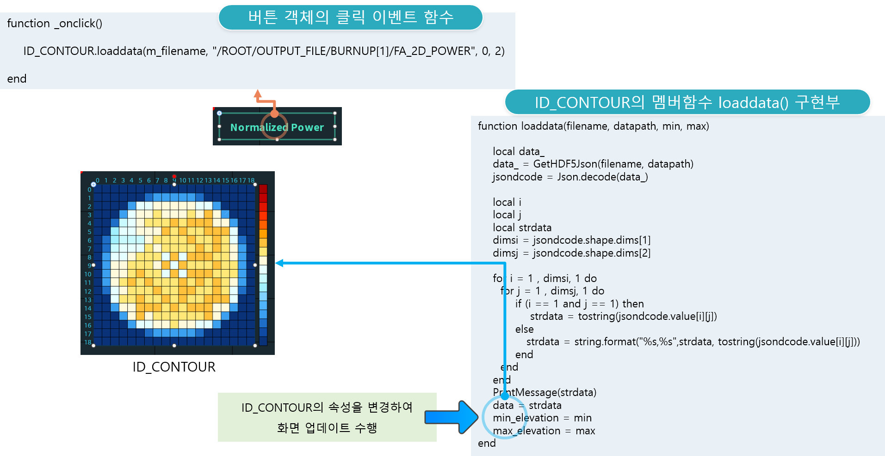

# enuSpace-Meta HDF5

## HDF5

 

서버측 저장소에 저장된 HDF5파일의 정보를 취득하여 화면에 표출할 수 있는 기능을 제공합니다.

 

### HDF5 Viewer (HDF5 뷰어)

서버측 저장소의 HDF5의 파일 목록을 제공합니다.

 

 

### HDF5 Visualization (HDF5 가시화)

서버측 저장소의 HDF5의 파일의 데이터를 취득하여 객체에 가시화를 수행합니다. 

 

