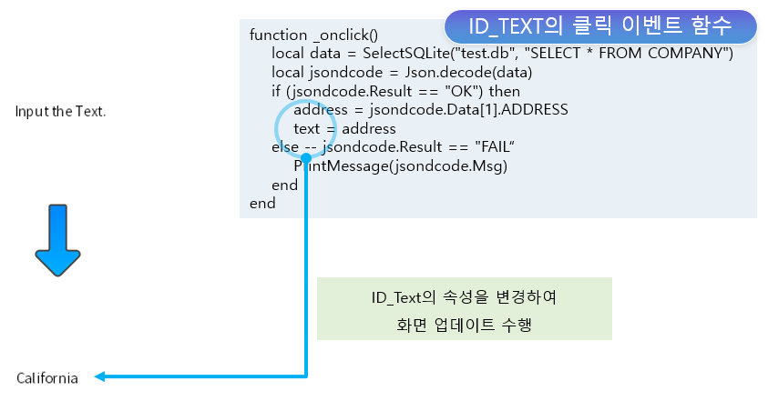

# enuSpace-Meta SQLite

## SQLite

서버측 저장소에 저장된 SQLite파일의 정보를 취득하여 화면에 표출할 수 있는 기능을 제공합니다.

### SQLite Viewer (SQLite 뷰어)

서버측 저장소의 SQLite의 파일 목록을 제공합니다.

### SQLite Visualization (SQLite 가시화)

서버측 저장소의 SQLite의 파일의 데이터를 취득하여 객체에 가시화를 수행합니다.

