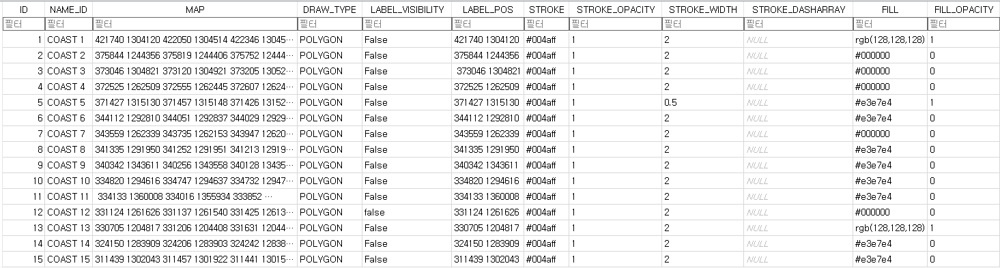
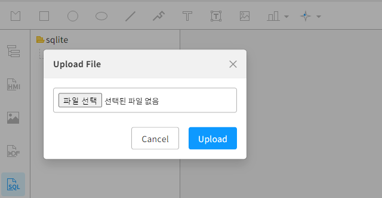

# 동적 그래픽 객체 만들기

본 문서는 그래픽 편집기를 통하여 동적으로 객체를 생성하고 생성된 객체를 활용하는 방법에 대하여 기술한다.

## 동적 객체 생성 방법

enuSpaceMeta는 그래픽 객체를 동적으로 생성하기 위한 스크립트 API 함수를 제공한다.
동적으로 객체를 생성하는 함수 API는 "3.1.1 그래픽 다루기 API" 항목을 참고하시기 바랍니다.

### 동적객체 생성 방법 및 절차

	- Step1. 동적으로 생성할 데이터베이스 준비 (외부 데이터베이스 또는 enuSpaceMeta에서 제공하는 SQLite DB를 등록하여 활용 가능)
	- Step2. 준비된 SQLite DB를 enuSpaceMeta 프로젝트에 등록
	- Step3. 등록된 DB를 이용하여 데이터 취득 (Lua Script)
	- Step4. 취득된 데이터를 활용하여 동적 그래픽 객체 생성 (Lua Script)


#### Step1. 데이터베이스 준비 (예시, 대한민국 해안선 위도와 경도자료)

대한민국의 해안선 자료 SQLite DB를 준비한다.



#### Step2. 준비된 SQLite DB를 enuSpaceMeta 프로젝트에 등록
서브메뉴(sqlite)를 통하여 준비된 DB를 등록한다.


#### Step3. 등록된 DB를 이용하여 데이터 취득 (Lua Script)
등록된 DB를 더블클릭하면, 해당 DB의 테이블 정보를 확인할 수 있다.
등록된 DB에서 나열된 테이블을 더블클릭하면, 해당 자료를 확인할 수 있다.

루아스크립트 이용하여 해당 테이블의 데이터를 취득하는 예시는 다음과 같다.

```lua
function _onload()
    local data = SelectSQLite("sqlite/FLIP_DATABASE.db", "SELECT * FROM COAST")
end
```

취득한 데이터는 Json 방식으로 데이터를 전달 받는다.
전달된 데이터는 루아스크립트의 json.decode 함수를 통하여 각 항목별 데이터를 취득한다.
아래의 코드는 해안선 데이터를 취득하는 예시 코드이다.
```lua
function _onload()

	-- COAST 설정 --------------------------------------------------------------
	local data = SelectSQLite("sqlite/FLIP_DATABASE.db", "SELECT * FROM COAST")
	local jsondcode = Json.decode(data)
	
	local x, y
	local tx, ty
	local latitudeString, longitudeString
	
	if (jsondcode.Result == "OK") then
		for i=1, #jsondcode.Data do
			map = jsondcode.Data[i].MAP
			mapid = jsondcode.Data[i].NAME_ID
			mapid = mapid:gsub("%s+", "")
			_fill = jsondcode.Data[i].FILL
			_fill_opacity = jsondcode.Data[i].FILL_OPACITY
			_stroke = jsondcode.Data[i].STROKE
			_stroke_opacity = jsondcode.Data[i].STROKE_OPACITY
			_stroke_width = jsondcode.Data[i].STROKE_WIDTH
		end
	else		-- jsondcode.Result == "FAIL"
		PrintMessage(jsondcode.Msg)
	end
end
```

#### Step4. 취득된 데이터를 활용하여 동적 그래픽 객체 생성 (Lua Script)

취득된 데이터를 루아스크립트를 이용하여 개별 데이터를 취득하였다면, 해당 정보를 이용하여 동적 객체를 생성한다.
아래의 코드와 같이 동적으로 객체를 생성하고, 생성된 객체의 속성값을 변경할 수 있다. 
동적 생성시 각각의 파라미터 입력 정보는 "3.1.1 그래픽 다루기 API" 항목을 참고하시기 바랍니다.

```lua
	local obj = CreatePolygon(mapid, combined, 0,0)
	obj.fill = _fill
	obj.fill_opacity = tonumber(_fill_opacity)
	obj.stroke = _stroke
	obj.stroke_opacity = tonumber(_stroke_opacity)
	obj.stroke_width = tonumber(_stroke_width)
```

해안선 위도와 경도 정보를 이용하여 동적 객체를 생성하는 예시 코드이다. 본 코드에는 위도와 경도를 x, y로 변환 함수를 포함하고 있다. 
```lua
function _onload()

    local obj = GetNodeByID("COAST7")

    if (obj == nil) then
	
		-- COAST 설정 --------------------------------------------------------------
		local data = SelectSQLite("sqlite/FLIP_DATABASE.db", "SELECT * FROM COAST")
		local jsondcode = Json.decode(data)
		
		local x, y
		local tx, ty
		local latitudeString, longitudeString
		
		if (jsondcode.Result == "OK") then
			for i=1, #jsondcode.Data do
				map = jsondcode.Data[i].MAP
				mapid = jsondcode.Data[i].NAME_ID
				mapid = mapid:gsub("%s+", "")
				_fill = jsondcode.Data[i].FILL
				_fill_opacity = jsondcode.Data[i].FILL_OPACITY
				_stroke = jsondcode.Data[i].STROKE
				_stroke_opacity = jsondcode.Data[i].STROKE_OPACITY
				_stroke_width = jsondcode.Data[i].STROKE_WIDTH
				local cdata = {}
				local count = 0
				for str_data in map:gmatch("%S+") do
					if (count == 0) then
						latitudeString = str_data
						count = count + 1
					else 
						longitudeString = str_data
						x, y = convertStringToCoordinates(latitudeString, longitudeString)
						tx, ty = latlon2xy(x, y)
						count  = 0
						table.insert(cdata, string.format("%f,%f", tx/2000-6800, -ty/2000+ 2800))
						combined = table.concat(cdata, " ") 
					end
				end
				local obj = CreatePolygon(mapid, combined, 0,0)
				obj.fill = _fill
				obj.fill_opacity = tonumber(_fill_opacity)
				obj.stroke = _stroke
				obj.stroke_opacity = tonumber(_stroke_opacity)
				obj.stroke_width = tonumber(_stroke_width)
			end
		else		-- jsondcode.Result == "FAIL"
			PrintMessage(jsondcode.Msg)
		end
	end
end
```

기타 위 함수를 동적시키기 위해서 추가된 루아 함수들 (위도, 경도 좌표 변환 함수)
```lua
function toRadians(degrees)
  return degrees * (math.pi / 180)
end

function convertToDegrees(hours, minutes, seconds)
  local degrees = math.abs(hours) + minutes/60 + seconds/3600
  -- 시간 값의 부호를 적용하여 Latitude와 Longitude 값을 구분
  if hours < 0 or minutes < 0 or seconds < 0 then
    degrees = -degrees
  end
  return degrees
end

function convertStringToCoordinates(latitudeString, longitudeString)
  -- 위도 변환
  local latHours = tonumber(latitudeString:sub(1, 2))
  local latMinutes = tonumber(latitudeString:sub(3, 4))
  local latSeconds = tonumber(latitudeString:sub(5, 6))
  local latitude = convertToDegrees(latHours, latMinutes, latSeconds)

  -- 경도 변환
  local lonHours = tonumber(longitudeString:sub(1, 3))
  local lonMinutes = tonumber(longitudeString:sub(4, 5))
  local lonSeconds = tonumber(longitudeString:sub(6, 7))
  local longitude = convertToDegrees(lonHours, lonMinutes, lonSeconds)

  return latitude, longitude
end

function latlon2xy(lat, lon)
    local x = lon * 20037508.34 / 180
    local y = math.log(math.tan((90 + lat) * math.pi / 360)) / (math.pi / 180)
    y = y * 20037508.34 / 180
    return x, y
end

function xy2latlon(x, y)
    local lon = x * 180 / 20037508.34
    local lat = math.atan(math.exp(y * math.pi / 20037508.34)) * 360 / math.pi - 90
    return lat, lon
end

```

스크립트 실행후 화면에 출력 결과


