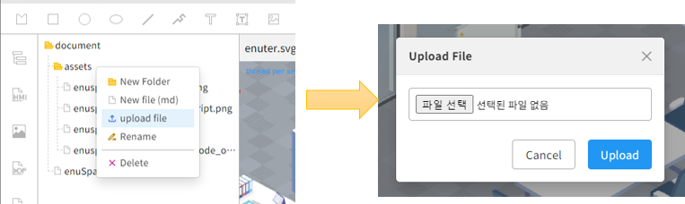

# MarkDown 문서 제작

본 문서는 그래픽 편집기를 통하여 MarkDown 문서를 생성하고, 생성된 문서를 특정 그래픽 객체 이벤트를 통하여 제공하는 방법에 대하여 기술한다. 

## MarkDown 문서 편집기 사용 방법
enuSpaceMeta 편집기의 좌측 MD 파일 툴바를 선택합니다. document 디렉토리를 선택하고 오른쪽 팝업메뉴 New file (md)메뉴를 통하여 새로운 파일을 생성합니다.


생성된 MD 파일을 선택하고 오른쪽 팝업메뉴 edit를 선택합니다. 선택된 MD 파일을 편집할 수 있는 편집기가 제공됩니다.


## MarkDown 문서에 이미지 표출 방법

먼저 MarkDown파일에 연결하고자 하는 이미지 파일을 등록합니다. 




MarkDown 편집기에서 등록된 이미지를 연결합니다. assets 디렉토리 하위에 enuspace_meta_layout.png 파일을 등록 하였다면 연결패스는 

```

```

위와 같이 추가합니다.


