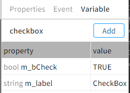

# enuSpace-Meta Component (Window Control)

## Window Control 제작

본 문서는 enuSpace-Meta 웹 그래픽 편집기를 이용하여 윈도우에서 사용하는 체크박스, 라디오 버튼 컴포넌트를 제작하고 픽처에서 활용하는 방법에 대하여 기술한다.

### Component 제작

#### RadioBox 제작

HMI 라이브러리 파일에 Add Symbol 팝업메뉴를 통하여 Radiobox 심볼을 생성한다. 생성된 심볼에 멤버변수를 생성한다.
멤버변수는 체크 상태를 확인할 수 있는 boolean 변수와 컴포넌트의 라벨을 설정할 수 있는 변수를 생성한다.




웹 그래픽 편집기의 Project Explorer에서 라이브러리 svg 파일을 선택하여 팝업메뉴 Show Code를 통하여 생성된 내용을 확인할 수 있다.

```svg
...
			<pg-attribute type="string" variable="m_label1" initial="Radio1" desc="" source-type="local"></pg-attribute>
			<pg-attribute type="string" variable="m_label2" initial="Radio2" desc="" source-type="local"></pg-attribute>
			<pg-attribute type="string" variable="m_label3" initial="Radio3" desc="" source-type="local"></pg-attribute>
			<pg-attribute type="int" variable="m_number" initial="1" desc="" source-type="local"></pg-attribute>
... 계속

```

그래픽 객체를 생성하여 아래 그림과 같이 화면을 구성한다.

구성된 화면에 멤버변수와 연계할 텍스트 객체와 체크시 체크여부를 확인할 수 있는 객체를 생성하고 다음과 같이 설정한다.


그래픽 객체와 멤버변수 설정이 완료되었으면, 스크립트를 이용하여 컴포넌트의 기능을 구현한다. 

컴포넌트의 멤버변수 값을 SetAttribute 수행시 호출 되는 _onload()함수에 아래 그림과 같이 객체와 변수를 할당한다.

```lua
function _onload()
    ID_TITLE1.text = m_label1
    ID_TITLE2.text = m_label2
    ID_TITLE3.text = m_label3  
    radioclick(m_number)
end

function radioclick(number)
	if (number == 0) then
        ID_CHK1.visibility = true
        ID_CHK2.visibility = false
        ID_CHK3.visibility = false                  
    elseif (number == 1) then
        ID_CHK1.visibility = false
        ID_CHK2.visibility = true
        ID_CHK3.visibility = false                   
    else
        ID_CHK1.visibility = false
        ID_CHK2.visibility = false
        ID_CHK3.visibility = true 
    end
end
```

컴포넌트를 클릭하였을 경우, 체크 상태정보를 변경하기 위한 스크립트를 _onclick()함수에 추가한다.
클릭이벤트 발생시 멤버변수값을 변경하고, 변경된 값을 기반으로 그래픽 객체의 Visibility 속성을 변경한다.
```lua
function _onclick()
	m_number = 0
    radioclick(m_number)
end

function _onclick()
	m_number = 1
    radioclick(m_number)
end

function _onclick()
	m_number = 2
    radioclick(m_number)
end
```

#### RadioBox 활용하기

생성된 컴포넌트를 HMI메뉴를 선택, 추가된 컴포넌트를 선택하여 Picture 화면에 추가를 수행한다.
Picture 화면에서 추가된 컴포넌트를 선택하고 객체를 인지할 수 있는 ID로 변경, SetAttribure를 통하여 등록된 멤버변수의 라벨값을 변경한다.

실제 런타임 중에 체크상태 값을 가져오기 위해서는 앞에서 설정한 ID와 추가한 m_number 통하여 데이터를 가져올수 있다.
ID를 ID_RADIO 변경하였을 경우 ID_RADIO.m_number 변수를 통하여 확인 가능하다.


#### RadioBox 컴포넌트 (코드)
```svg
<?xml version="1.0" encoding="UTF-16"?>
<svg id="ID_fFNLsA" visibility="visible" lock="false" gradient="false" stroke="rgb(0,119,189)" stroke-opacity="1" stroke-width="1" transform="translate(0,0) rotate(0) scale(1,1)" pg-xcenter="0" pg-ycenter="0" stroke-visibility="visible" stroke-linecap="butt" stroke-linejoin="miter"
	EnuSpaceMetaCore-version="1.0.0.0"
	xmlns="http://www.w3.org/2000/svg"
	xmlns:xlink="http://www.w3.org/1999/xlink"
	width="1920"
	height="1080"
	outside-color="rgb(0,0,0)"
	background-color="rgb(255,255,255)" grid="false" grid-dash="false">
	<defs id="ID_fFNLsA0">
		<symbol id="radiobox3" visibility="visible" lock="false" gradient="false" stroke="rgb(0,119,189)" stroke-opacity="1" stroke-width="1" transform="translate(0,0) rotate(0) scale(2.14359,2.14359)" pg-xcenter="0" pg-ycenter="0" stroke-visibility="visible" stroke-linecap="butt" stroke-linejoin="miter" onload="_onload()" background-color="rgb(111, 111, 111)" grid="true" x-offset="100" y-offset="100" grid-color="rgb(66, 66, 66)" grid-color-opacity="0.43" grid-dash="false">
			<script id="ID_fFa8vo" type="text/lua">
<![CDATA[function radioclick(number)
	if (number == 0) then
        ID_CHK1.visibility = true
        ID_CHK2.visibility = false
        ID_CHK3.visibility = false                  
    elseif (number == 1) then
        ID_CHK1.visibility = false
        ID_CHK2.visibility = true
        ID_CHK3.visibility = false                   
    else
        ID_CHK1.visibility = false
        ID_CHK2.visibility = false
        ID_CHK3.visibility = true 
    end
end
function _onload()
    ID_TITLE1.text = m_label1
    ID_TITLE2.text = m_label2
    ID_TITLE3.text = m_label3  
    radioclick(m_number)
end]]>
			</script>
			<pg-attribute type="string" variable="m_label1" initial="Radio1" desc="" source-type="local"></pg-attribute>
			<pg-attribute type="string" variable="m_label2" initial="Radio2" desc="" source-type="local"></pg-attribute>
			<pg-attribute type="string" variable="m_label3" initial="Radio3" desc="" source-type="local"></pg-attribute>
			<pg-attribute type="int" variable="m_number" initial="1" desc="" source-type="local"></pg-attribute>
			<g id="ID_G1" visibility="visible" lock="false" gradient="false" stroke="rgb(0,119,189)" stroke-opacity="1" stroke-width="1" transform="translate(0,0.049818) rotate(0) scale(1,1)" pg-xcenter="0" pg-ycenter="0" stroke-visibility="visible" stroke-linecap="butt" stroke-linejoin="miter" onclick="_onclick()">
				<script id="ID_fFRLwl" type="text/lua">
<![CDATA[function _onclick()
	m_number = 0
    radioclick(m_number)
end]]>
				</script>
				<rect id="ID_CIRCLE1" visibility="visible" lock="false" gradient="false" stroke="rgb(75,226,192)" stroke-opacity="1" stroke-width="3" transform="translate(-21.0118,-19.9639) rotate(0) scale(1,1)" pg-xcenter="0" pg-ycenter="0" stroke-visibility="visible" stroke-linecap="butt" stroke-linejoin="miter" x="0" y="0" width="20" height="20" rx="10" ry="10" fill-visibility="hidden" fill="rgb(0,174,238)" fill-opacity="1"></rect>
				<text id="ID_TITLE1" visibility="visible" lock="false" gradient="false" stroke="rgb(75,226,192)" stroke-opacity="1" stroke-width="1" transform="translate(3.53196,-0.332887) rotate(0) scale(1,1)" pg-xcenter="0" pg-ycenter="0" stroke-visibility="visible" stroke-linecap="butt" stroke-linejoin="miter" x="0" y="0" dx="0" dy="0" font-family="NotoSansKR" font-size="20" font-weight="bold" font-style="normal" text-anchor="start" baseline-shift="0" baseline-height="0" fill="rgb(0,174,238)" fill-opacity="1" text-decoration="none" pg-line-count="1" pg-oneline-height="0">
Radio1
				</text>
				<polygon id="ID_CHK1" visibility="hidden" lock="false" gradient="false" stroke="rgb(142, 244, 220)" stroke-opacity="1" stroke-width="1" transform="translate(-27.243,-14.743) rotate(0) scale(1,1)" pg-xcenter="0" pg-ycenter="0" stroke-visibility="visible" stroke-linecap="round" stroke-linejoin="round" points="0.368538,-2.57977 13.6453,11.012 29.4452,-11.4908 17.4788,-0.841024 12.146,2.86955" fill-visibility="visible" fill="rgb(237, 109, 92)" fill-opacity="1"></polygon>
			</g>
			<g id="ID_G2" visibility="visible" lock="false" gradient="false" stroke="rgb(0,119,189)" stroke-opacity="1" stroke-width="1" transform="translate(140,0) rotate(0) scale(1,1)" pg-xcenter="0" pg-ycenter="0" stroke-visibility="visible" stroke-linecap="butt" stroke-linejoin="miter" onclick="_onclick()">
				<script id="ID_fFRLwl" type="text/lua">
<![CDATA[function _onclick()
	m_number = 1
    radioclick(m_number)
end]]>
				</script>
				<rect id="ID_CIRCLE2" visibility="visible" lock="false" gradient="false" stroke="rgb(75,226,192)" stroke-opacity="1" stroke-width="3" transform="translate(-21.0118,-19.9639) rotate(0) scale(1,1)" pg-xcenter="0" pg-ycenter="0" stroke-visibility="visible" stroke-linecap="butt" stroke-linejoin="miter" x="0" y="0" width="20" height="20" rx="10" ry="10" fill-visibility="hidden" fill="rgb(0,174,238)" fill-opacity="1"></rect>
				<text id="ID_TITLE2" visibility="visible" lock="false" gradient="false" stroke="rgb(75,226,192)" stroke-opacity="1" stroke-width="1" transform="translate(3.53196,-0.332887) rotate(0) scale(1,1)" pg-xcenter="0" pg-ycenter="0" stroke-visibility="visible" stroke-linecap="butt" stroke-linejoin="miter" x="0" y="0" dx="0" dy="0" font-family="NotoSansKR" font-size="20" font-weight="bold" font-style="normal" text-anchor="start" baseline-shift="0" baseline-height="0" fill="rgb(0,174,238)" fill-opacity="1" text-decoration="none" pg-line-count="1" pg-oneline-height="0">
Radio2
				</text>
				<polygon id="ID_CHK2" visibility="visible" lock="false" gradient="false" stroke="rgb(142, 244, 220)" stroke-opacity="1" stroke-width="1" transform="translate(-27.243,-14.743) rotate(0) scale(1,1)" pg-xcenter="0" pg-ycenter="0" stroke-visibility="visible" stroke-linecap="round" stroke-linejoin="round" points="0.368538,-2.57977 13.6453,11.012 29.4452,-11.4908 17.4788,-0.841024 12.146,2.86955" fill-visibility="visible" fill="rgb(237, 109, 92)" fill-opacity="1"></polygon>
			</g>
			<g id="ID_G3" visibility="visible" lock="false" gradient="false" stroke="rgb(0,119,189)" stroke-opacity="1" stroke-width="1" transform="translate(280,0) rotate(0) scale(1,1)" pg-xcenter="0" pg-ycenter="0" stroke-visibility="visible" stroke-linecap="butt" stroke-linejoin="miter" onclick="_onclick()">
				<script id="ID_fFRLwl" type="text/lua">
<![CDATA[function _onclick()
	m_number = 2
    radioclick(m_number)
end]]>
				</script>
				<rect id="ID_CIRCLE3" visibility="visible" lock="false" gradient="false" stroke="rgb(75,226,192)" stroke-opacity="1" stroke-width="3" transform="translate(-21.0118,-19.9639) rotate(0) scale(1,1)" pg-xcenter="0" pg-ycenter="0" stroke-visibility="visible" stroke-linecap="butt" stroke-linejoin="miter" x="0" y="0" width="20" height="20" rx="10" ry="10" fill-visibility="hidden" fill="rgb(0,174,238)" fill-opacity="1"></rect>
				<text id="ID_TITLE3" visibility="visible" lock="false" gradient="false" stroke="rgb(75,226,192)" stroke-opacity="1" stroke-width="1" transform="translate(3.53196,-0.332887) rotate(0) scale(1,1)" pg-xcenter="0" pg-ycenter="0" stroke-visibility="visible" stroke-linecap="butt" stroke-linejoin="miter" x="0" y="0" dx="0" dy="0" font-family="NotoSansKR" font-size="20" font-weight="bold" font-style="normal" text-anchor="start" baseline-shift="0" baseline-height="0" fill="rgb(0,174,238)" fill-opacity="1" text-decoration="none" pg-line-count="1" pg-oneline-height="0">
Radio3
				</text>
				<polygon id="ID_CHK3" visibility="hidden" lock="false" gradient="false" stroke="rgb(142, 244, 220)" stroke-opacity="1" stroke-width="1" transform="translate(-27.243,-14.743) rotate(0) scale(1,1)" pg-xcenter="0" pg-ycenter="0" stroke-visibility="visible" stroke-linecap="round" stroke-linejoin="round" points="0.368538,-2.57977 13.6453,11.012 29.4452,-11.4908 17.4788,-0.841024 12.146,2.86955" fill-visibility="visible" fill="rgb(237, 109, 92)" fill-opacity="1"></polygon>
			</g>
		</symbol>
	</defs>
</svg>
```