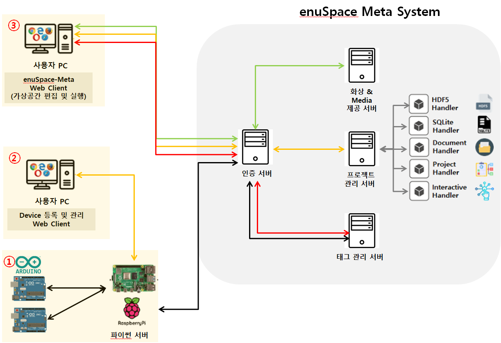

# Introduction

## 플랫폼 구성도

enuSpace Meta 플랫폼은 IoT기기를 쉽게 연결하여 실시간으로 데이터를 조회, 제어 할 수 있는 서비스입니다. enuSpace Meta 시스템은 인증 서버를 거쳐 인증된 사용자만 서비스를 사용할 수 있습니다. 데이터는 태그 관리 서버로 적재됩니다.

플랫폼은 ①~③ 및 enuSpace Meta System으로 구성되어있다. enuSpace Meta System은 '2.시스템 개념'에서 기술한다.

①~③의 설명은 다음과 같다.
### ① 아두이노 & 라즈베리파이

#### 아두이노
> IoT 디바이스 중 오픈소스 하드웨어의 가장 기초적인 기기로는 아두이노가 대표적입니다. 아두이노는 간단한 디지털 및 아날로그 입출력을 제어하고 통신이 가능한 마이크로 컨트롤러 기반 보드입니다. 

> enuSpace Meta System에서 아두이노는 센서로부터 데이터를 수집하고, 라즈베리파이로부터 제어 신호가 들어오면 센서를 제어하는 역할을 수행합니다. 

#### 라즈베리파이

> 라즈베리파이는 완전한 운영체제를 바탕으로 다양한 응용 프로그램을 실행하고 네트워크 기능이 포함되어 있기 때문에  서버에 적합하다고 볼 수 있습니다.

> enuSpace Meta System 에서 라즈베리파이는 Python Server 가 있으며 아두이노로부터 수집한 데이터를 모니터링하고, 제어할 수 있는 Device Web Page를 제공합니다. 그리고 센서 데이터를 태그 관리 서버의 포맷에 적합하게 변경 후 전송하고, 제어 요청을 받는 통신 기능도 담당하고 있습니다. 

### ② Device Web

Device Web Page는 파이썬 서버에서 제공하는 웹페이지 입니다. 페이지에서 제공하는 기능은 다음과 같습니다. 자세한 설명 및 예시는 "7.2 Device - 2.Device WEB 사용방법"에서 확인할 수 있습니다.

#### 기능
> 로그인 : 토큰을 발행해 서버에서 인증한 유저인지 확인 후 서비스를 사용할 수 있습니다.

> 테이블 생성 : 아두이노들의 정보를 담을 테이블을 생성합니다.

> 테이블 삭제 : 테이블을 삭제합니다.

> 태그 수정 : 아두이노의 각 핀에 상응하는 태그들은 테이블 생성시 자동으로 생성되며, 이를 수정할 수 있습니다. 

> 데이터 적재 : 수집한 센서 데이터를 데이터베이스 서버에 적재할지 여부를 정할 수 있습니다.

> 데이터 원격 모니터링 : 아두이노의 핀으로부터 수집하는 데이터를 웹에서 모니터링 할 수 있습니다.

> 핀 제어 : 웹의 버튼을 통해 아두이노에 연결된 핀을 제어할 수 있습니다.

### ③ enuSpace Meta Web

enuSpace-Meta Web은 IoT 디바이스 시스템에서 제공하는 웹 페이지입니다.  페이지에서 제공하는 기능은 다음과 같습니다. 자세한 설명 및 예시는 "7.3 enuSpace-Meta WEB 사용방법" 에서 확인할 수 있습니다.

####  기능
> 로그인 : 토큰을 발행해 서버에서 인증한 유저인지 확인 후 서비스를 사용할 수 있습니다.

> 테이블 생성 : IoT 디바이스의 정보를 담을 테이블을 생성합니다.

> 테이블 수정 : 테이블을 수정합니다.

> 테이블 삭제 : 테이블을 삭제합니다.

> 태그 생성 : 태그를 개별 추가하거나, CSV파일 형식으로 업로드할 수 있습니다.

> 태그 삭제 : 태그를 삭제할 수 있습니다.

> 태그 수정 : 태그를 수정할 수 있습니다.

> 태그 다운로드 : 태그를 CSV파일 형식으로 다운로드 받을 수 있습니다.

> 데이터 적재 : 수집한 센서 데이터를 데이터베이스 서버에 적재할지 여부를 정할 수 있습니다.

> 데이터 가시화 : IoT 디바이스 테이블의 데이터를 그래프나 텍스트 등으로 가시화할 수 있습니다.

> 제어 : IoT 디바이스 시스템에 내장되어있는 함수를 활용해 DB의 값을 Set할 수 있습니다.

## enuSpace Meta 시스템이 제공하는 다양한 기능

> enuSpace-Meta 플랫폼의 웹페이지와 편집기에서 IoT 데이터를 원격으로 조회, 가시화, 제어 할 수 있습니다.

> 실시간 데이터를 처리하는데 특화된 데이터베이스를 적용하여 IoT 데이터를 처리할 수 있습니다.

> 인증 서버는 사용자의 토큰을 활용해 인증절차를 수행합니다.

> 라즈베리파이 기반 웹 페이지(이하 Device Web)에서 아두이노를 원격으로 조회, 제어할 수 있습니다. 기기마다 고유한 Device KEY가 있으며, Device KEY를 활용하여 enuSpace Meta와 데이터 연동이 가능합니다.

