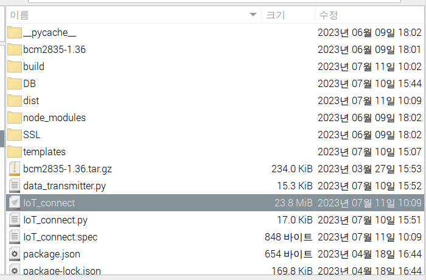

# Device 환경설정 개요

enuSpace Meta 플랫폼에서 IoT 기기 연동을 쉽고 간편하게 진행할 수 있습니다. 환경설정 이후 WEB 사용 방법을 확인하면 원활하게 플랫폼을 이용할 수 있습니다. 플랫폼 환경설정 및 사용방법은 다음과 같습니다.

## IoT 기기 준비

데이터를 수집하기 위한 기기를 준비해 주십시오. 기기는 각각 아두이노, 라즈베리파이를 필요로 합니다.

> 아두이노 : 센서로부터 데이터를 수집하고 제어하는 기능
 
> 라즈베리파이 : 인증 서버와 아두이노간의 통신을 중개하고 데이터를 전송하는 기능

## 아두이노

### 통신을 위한 세팅

먼저 아두이노와 라즈베리파이간 통신을 위한 Firmata 라이브러리를 설치해야 합니다. enuSpace Meta System에서 아두이노에 Firmata 라이브러리 설치 이외의 작업은 하지 않지만, 사용자는 필요시 추가로 코드를 업로드 할 수 있습니다.

#### Firmata 

> Firmata : 마이크로컨트롤러와 컴퓨터 간의 통신을 간단하게 만들어주는 프로토콜이며 이를 구현하는 라이브러리입니다. 마이크로 컨트롤러의 디지털 입력 및 출력, 아날로그 입력, PWM, 서보제어, I2C 및 기타 센서와 통신 등 다양한 기능을 컴퓨터에서 제어할 수 있도록 도와줍니다. 주로 아두이노와 호환되는 보드에서 많이 사용되며 아두이노IDE와 함께 제공되는 표준 Firmata 라이브러리를 통해 프로토콜을 구현할 수 있습니다.

#### 세팅 방법
1.아두이노를 PC에 USB케이블로 연결합니다.

2.Arduino IDE를 다운로드받고, 실행한 후 아두이노보드를 연결합니다.

3.파일 - 예제 - 모든예제 - Standard Firmata를 클릭한다.추가가 잘 되었다면 5번과정, 만약 Firmata가 보이지 않는다면 4번과정을 진행해 다운로드를 받아야 합니다.

4.Arduino IDE - 스케치 - 라이브러리 포함하기 - 라이브러리 관리 클릭.

라이브러리 검색 창이 나오면 firmata 를 입력한 후 다운로드 받습니다.

5.3번 과정에서 Standard Firmata를 클릭하면 새로운 창이 나타나는데, 체크표시를 눌러 컴파일 후 업로드하면 아두이노에 업로드 됩니다.

아두이노 회로도는 각자 구성하고 각 핀의 센서 데이터 수집, 제어는 firmata 라이브러리를 활용해 라즈베리파이에서 진행합니다.

## 라즈베리파이 

> 라즈베리파이는 아두이노로부터 데이터를 전달받아 Meta서버, DAQ서버로 전송하며, 통신 프로토콜은 firmata를 활용합니다. 아두이노와 연동은 USB케이블을 시리얼 포트에 연결합니다.

1.라즈베리파이에 기본적으로 마우스, 키보드, 랜선, 모니터 연결을 통해 운영체제를 설치합니다. 

2.터미널에서 ifconfig 를 입력하면 다음과 같이 IP를 확인할 수 있습니다. (ex 192.168.0.224)
  

3.IoT_connect 실행파일을 실행하면 서버가 작동합니다.

4.IoT connect 파일을 더블클릭 후 터미널에서 실행을 누릅니다.

5.그림과 같이 Running on https:// IP:5000 / 이라는 문구가 나온다면 정상적으로 서버가 실행된 것입니다.

6.주소창에 IP:5000을 입력해 Device Web 페이지를 확인합니다.

> 만약 주소창에 192.168.0.224:5000 (ifconfig에서 확인한 IP:5000)이 들어가지지 않는다면, 앞에 "https://"를 붙여서 다시 시도해봅니다.
