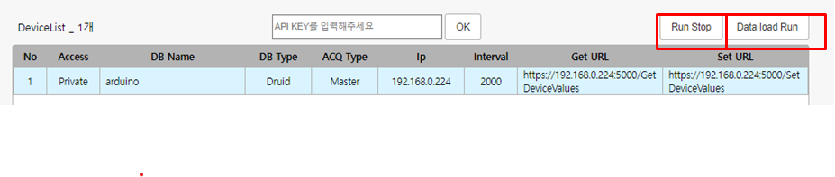
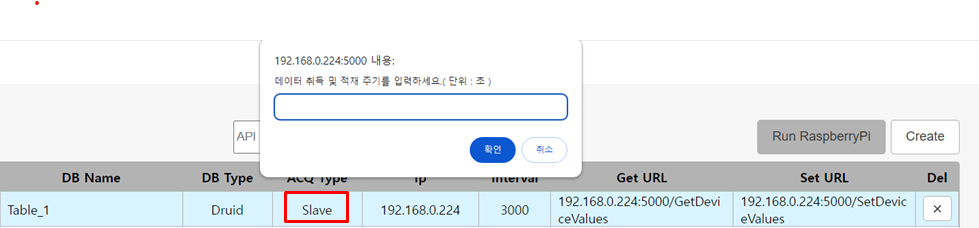
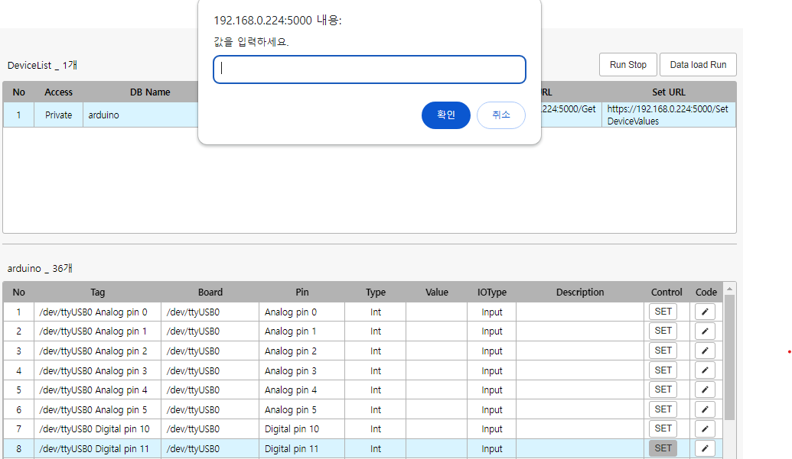

# Device Web 사용방법

## Login

해당 웹페이지는 파이썬서버에서 제공하는 아두이노 관리자 페이지입니다. 

"Device 환경설정" 중 ifconfig 명령어로 취득한 디바이스의 IP로, IP:5000으로 웹페이지에 접속할 수 있습니다.

<h4>1.해당 페이지는 enuSpace-Meta의 유저 정보로 로그인 할 수 있습니다. 회원가입은 Meta-Web에서만 가능합니다. </h4>

<h4>2.로그인이 성공했다면 서버에서 토큰을 제공하며 토큰을 통해 로그인 유지 및 보안을 인증합니다. 일정 시간동안 아무 활동을 하지 않을 시 로그아웃 될 수 있습니다.</h4>

## Create Table

로그인 시 테이블 존재 유무를 확인하여, 테이블이 없다면 바로 CreateTable 페이지로, 테이블이 있다면 MyPage로 넘어갑니다.

#### Create Table 1/2

> enuSpaceMeta IP : enuSpaceMeta 서버의 IP를 사용자가 입력하여 지정해주면 됩니다. 

> TableName : 연결되어있는 RaspBerry PI의 고유한 MAC주소가 기본값으로 지정되어있으며 사용자가 원하는 이름으로 작성하면 됩니다.

> DBType : 현재 Druid DB 하나만 사용중입니다.

> Acquistion Type : Master / Slave 둘중 하나를 선택합니다. 
  > - Master : DB가 Device에 직접 접근할 수 있는 상태.  
  > - Slave : DB가 Device에 직접 접근할 수 없는 상태.

> Device IP : 연결되어있는 RaspBerry Pi의 IP주소입니다.

> Interval : Acquistion Type이 Master일 시 서버가 주기적으로 데이터를 요청할 시간 간격. 단위는 밀리세컨드입니다.

> Access : Public / Private 설정가능.
  > - Public : 공개 테이블로, 누구든 값을 조회하고 수정할 수 있습니다.
  > - Private : 비공개 테이블로, 본인만 값을 조회하고 수정할 수 있습니다.(기본값)

> GetURL : Acquistion Type이 Master일 시 서버가 데이터를 요청 할 URL

> SetURL : 서버가 직접 디바이스의 값을 Set 할 URL

#### Create Table 2/2

> No : Pin의 갯수

> Arduino_port : 아두이노 보드의 현재 연결된 시리얼 포트 이름입니다. 

> Pin : 연결된 보드의 핀 정보입니다.

> Pin_Tag : 핀에 대해 유저가 직접 작성하는 태그 이름. ex) Temp_1 작성하지 않는다면 Arduino_port + Pin 으로 작성됩니다

> IOType : 핀의 Input, Output, PWM을 정의합니다.

> Type : Int, Double, String을 선택합니다. 

> Pin_Value : 핀과 연결된 센서의 데이터값을 의미합니다. 

> Description : 해당 Tag에 대한 부가설명을 작성할 수 있습니다.

CreateTable을 실시하면 해당 디바이스에 대한 Device KEY를 발급받을 수 있습니다. Device KEY를 통해 테이블을 관리, 공유 할 수 있으며 해킹을 당했거나 변경을 원할경우 재생성 할 수 있습니다.

## MyPage

해당 페이지는 유저가 보유한 테이블을 조회하고 해당 태그에 대해 제어하는 기능을 제공합니다. Meta Web에서 테이블을 생성하고, Device Web 페이지에서 해당 테이블의 Device KEY를 입력하면 동일한 정보를 가져올 수 있습니다.

> Device KEY 입력 INPUT :  Device KEY를 입력하면, 해당 Device KEY에 해당하는 다른 테이블을 연동할 수 있습니다. 

> RUN Raspberry PI : 디바이스와의 통신을 시작합니다. 주기적으로 데이터를 수집하기 시작하며, 핀 제어를 할 수 있게 됩니다.

> Run Stop : 디바이스와의 통신을 중지합니다. 태그를 수정하려면 Run Stop 상태여야 합니다.

> Create : 디바이스 테이블을 생성합니다.

> Delete Button : 테이블 영역의 X 버튼을 누르면 테이블을 삭제할 수 있습니다. 

#### 디바이스 통신 Run / Stop

RUN Raspberry PI 를 통해 기기와의 통신을 시작하면, 그림과 같이 Run Stop버튼과 Data load Run 버튼이 생깁니다. 
> Run Stop : 기기와의 통신을 중지하고 Edit 모드로 변경합니다.

> Data load Run : 현재 기기의 데이터들을 DAQ 데이터베이스에 적재를 시작합니다. 
> * ACQ Type이 Master일 경우 테이블의 Interval마다 적재하며, Slave인 경우 사용자가 어느 주기마다 데이터를 적재할 것인지 Input창이 나타납니다.

#### 디바이스 통신 주기 (SLAVE)

#### 태그리스트 (Edit)

> No : Pin의 index 번호입니다.

> Tag : 태그이름입니다.

> Board : 연결되어있는 아두이노 보드의 시리얼 포트입니다.

> Pin : 연결된 보드의 핀 정보입니다.

> Type : Int, Double, String 등 Value의 타입입니다.

> Value : 핀과 연결된 센서의 데이터값을 의미합니다. 

> IOType : 핀의 Input, Output, PWM, servo 등을 정의합니다. 

> Description : 해당 Tag에 대한 부가설명입니다.

> Edit  : 해당 태그의 정보를 수정합니다.

> Code : 제어로직을 작성하면 그에 따라 핀이 제어될 수 있는 기능을 추가중입니다.

#### 태그리스트 (Run)

> Set : 해당 핀을 어느 수치로 제어할 것인지에 대한 입력 창입니다.

> LED 등 ON/OFF(HIGH,LOW) 관련 센서라면 1 or 0으로 입력
> servo 모터 등 각도 관련 센서라면 각도 입력(100도 => 100)