# enuSpace-Meta Web 사용 방법

## Login

1.enuspace.com에서 우측상단 Sign up 회원가입을 완료한 이후 Sign in을 눌러 로그인 합니다.
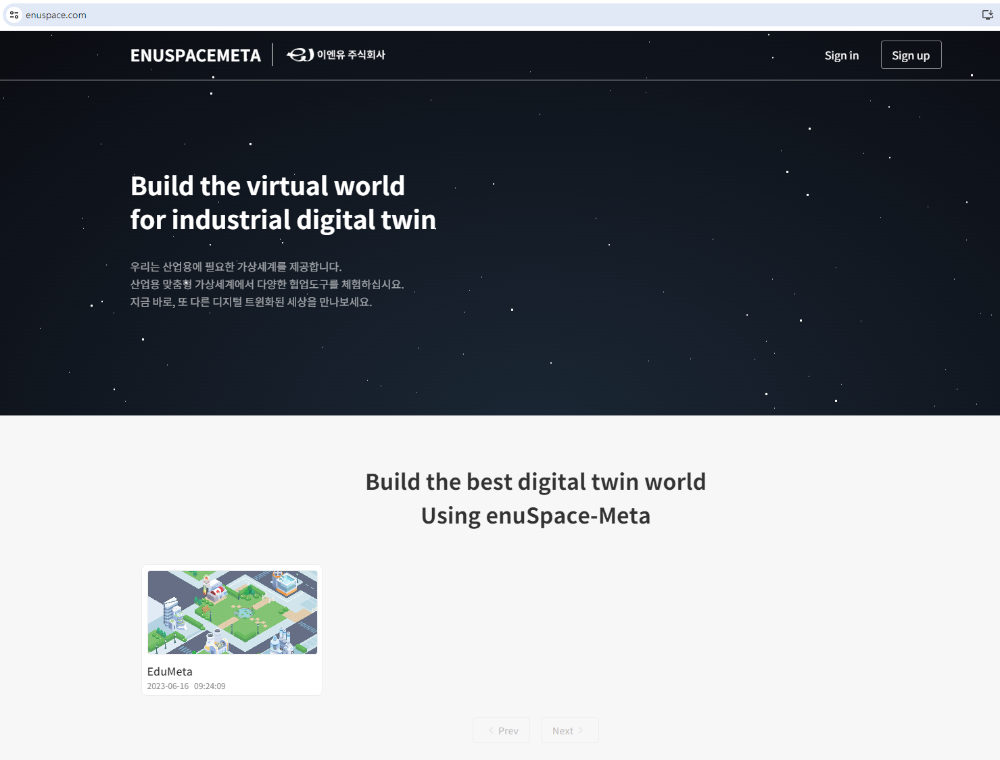

2.Tag Management 페이지로 이동합니다.

3.이후 + 버튼을 눌러 테이블 생성 절차를 진행합니다.

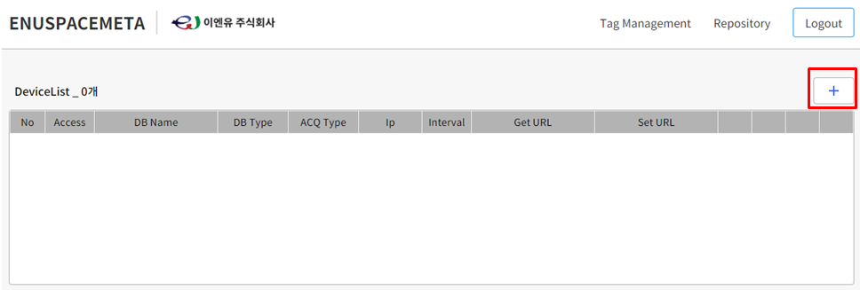

## Create Table
테이블을 생성하는 절차와 필요한 요소들에 대해 설명한다.

1."+" 버튼을 눌러 테이블 생성 절차를 진행합니다.

2.각 항목에 대해 작성합니다.

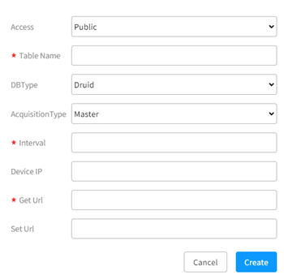

① Access : Public = 공개 / Private = 비공개

② Table Name : Table 이름

③ DB Type : 사용할 DB의 타입. 현재는 Druid DB 한가지밖에 없습니다.

④ Acquisition Type :

 > * Master = Druid DB가 Device의 주소를 알아 접근할 수 있는 상태로, DB가 주기적(Interval)으로 GetURL을 통해 Device로부터 값을 가져가 적재하며, Set URL을 통해 Device의 값을 제어합니다.

 > * Slave = Druid DB가 Device에 직접 접근할 수 없는 상태로, Device가 직접 주기적으로 DB에 값을 적재해야 합니다. Device는 주기적으로 DB의 값을 가져와 해당 값으로 Device 값들을 Set합니다. Device 제어가 필요할 때, DB를 제어할 값으로 Set 한 후 Device가 DB의 값을 가져가면 해당 값으로 제어됩니다.

⑤ Interval : Acquisition Type이 Master일 때 DB에 값을 적재할 주기. ms(밀리세컨드)단위이므로 1초당 1회 진행하려면 1000을 입력하면 됩니다.

⑥ Device IP : Device(라즈베리파이)의 Ip주소

⑦ Get URL : Acquisition Type이 Master일 때 DB가 값을 가져갈 수 있는 URL

⑧ Set URL : Acquisition Type이 Master일 때 DB가 값을 제어할 수 있는 URL

 *작성 예시
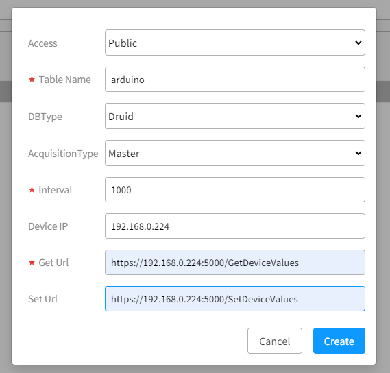

Device IP에는 7.2. Device > 1. Device 환경설정의 ifconfig에서 확인한 라즈베리파이 IP를 입력합니다.

GetURL, SetURL은 https://Device IP:5000/Get(Set)DeviceValues를 입력합니다.

## Table, Tag Management
테이블 관리와 태그의 추가 방법에 대해 설명한다.

1.Create Table이 잘 완료되었다면 다음과 같이 테이블 리스트가 보입니다.

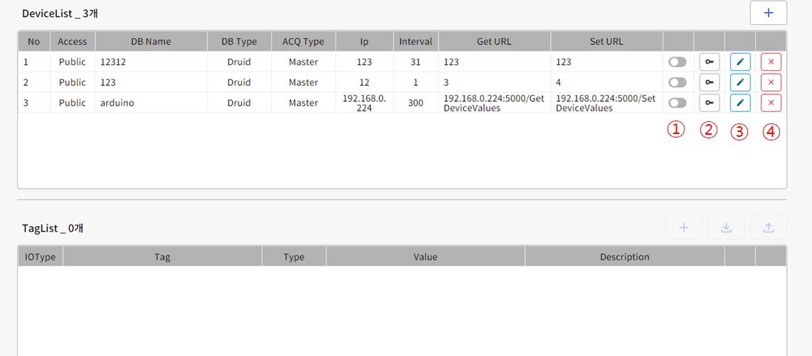

① 해당 테이블 데이터 Druid DB에 적재 유무

② Device KEY 확인 및 재발급 

③ 테이블 수정

④ 테이블 삭제

2.태그가 존재 할 경우 하단에서 해당 테이블의 태그를 확인할 수 있습니다. 태그 관련 기능은 수정, 삭제 및 개별추가, CSV파일 기반 업로드를 통한 추가, CSV파일 기반 다운로드 등을 포함하고 있습니다.

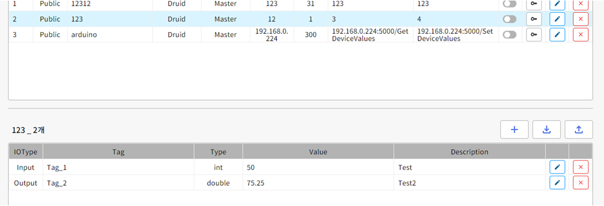

## Add Tag

태그 추가에는 개별 추가, CSV파일 기반 업로드를 통한 추가 총 2가지 방법이 있습니다.

#### 개별 추가

1.태그를 추가할 테이블을 선택 후 , + 버튼을 클릭합니다.

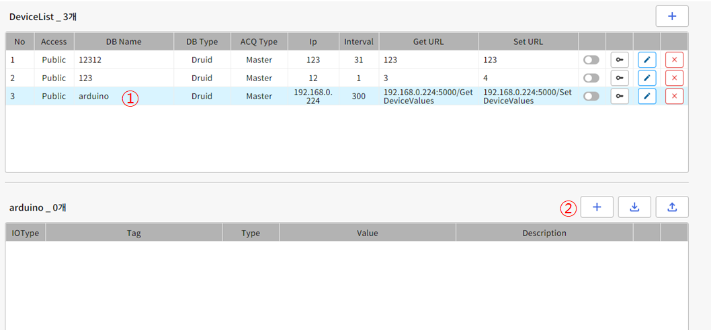

2.각 목록을 작성 후 Create 버튼을 클릭하면 태그가 생성됩니다.

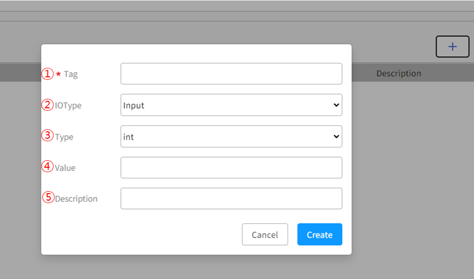

① Tag : 해당 태그에 대한 고유한 이름 작성
② IOType : 해당 태그에 대해 Input, Output, PWM 등의 타입에 대해 작성
③ Type : 해당 태그가 가질 값의 타입 int, string, double에 대해 작성
④ Value : 해당 태그의 값 
⑤ Description : 부가 설명

#### CSV파일 기반 업로드 추가

1.CSV파일 양식 확인을 위해 다운로드에 대해 먼저 설명하겠습니다. 다운로드는 그림에서 보이는 아이콘을 클릭하면 '다운로드' 폴더에 저장됩니다.

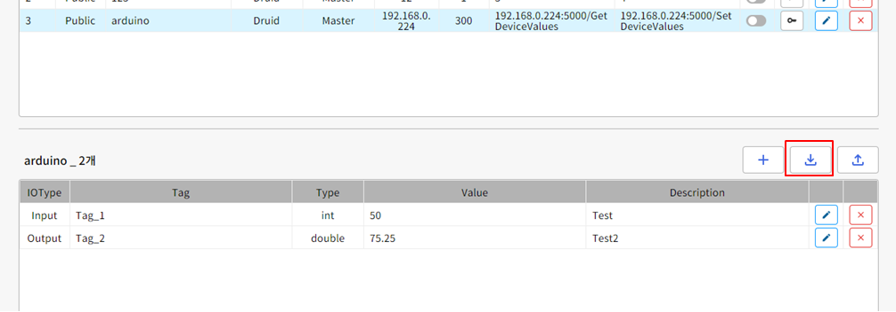

2.다운로드된 CSV파일 양식은 다음과 같습니다.

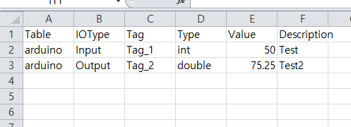

A1 : Table
B1 : IOType
C1 : Tag
D1 : Type
E1 : Value
F1 : Description

이후 2행부터 각 항목에 적합한 값을 작성하면 됩니다.

3.업로드할 테이블 선택 후 우측 업로드 버튼을 클릭하고, 어떤 csv파일을 업로드 할 지 선택하면 됩니다.

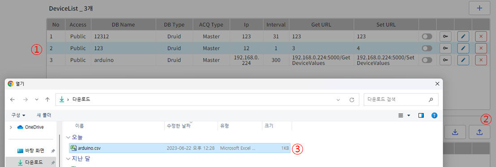

4.CSV파일 기반 업로드 추가에는 2가지 옵션이 있습니다.

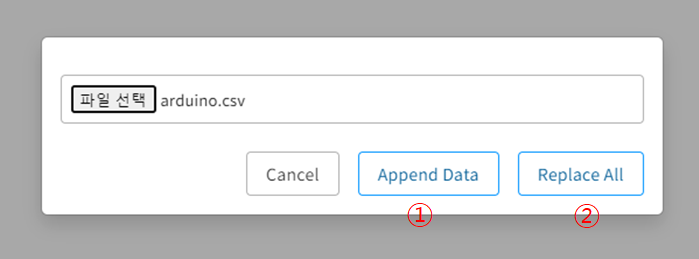

> Append Data : 기존 태그에 CSV파일 데이터를 덧붙입니다.
> Replace All : 기존 태그를 전부 삭제 후 CSV파일 데이터를 추가합니다.

