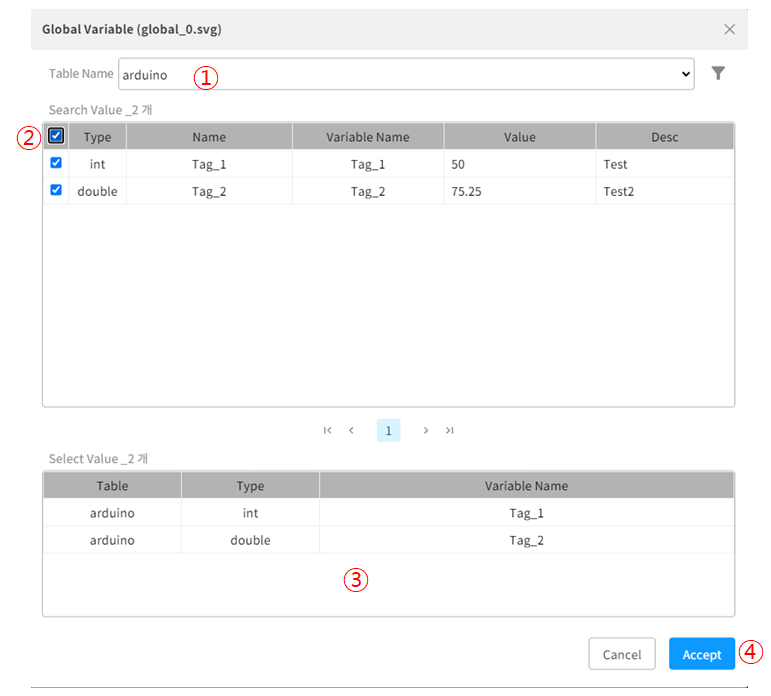
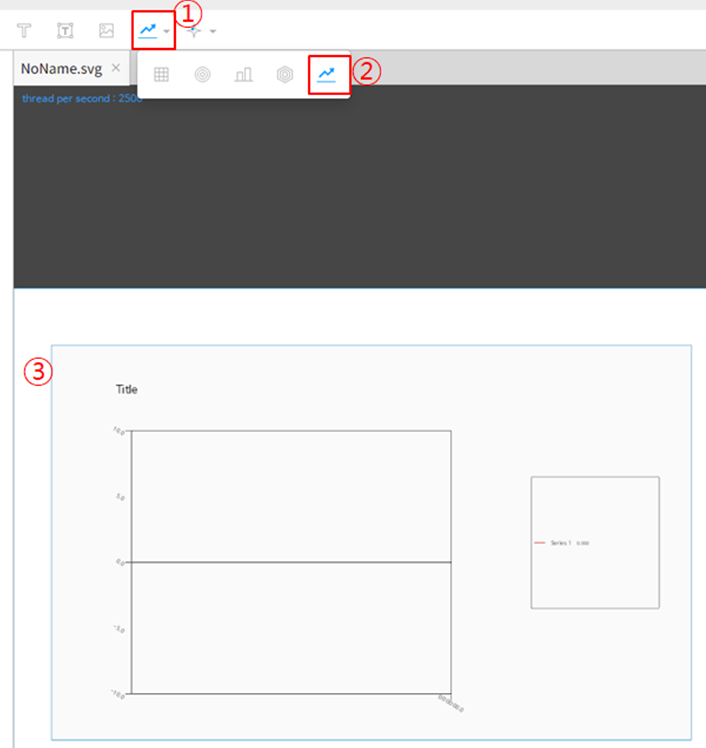
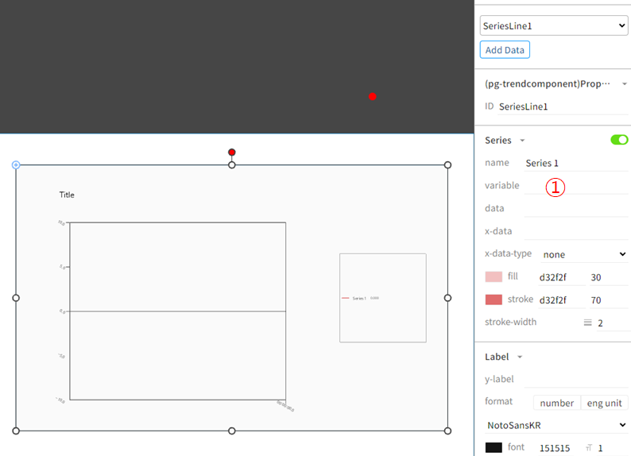
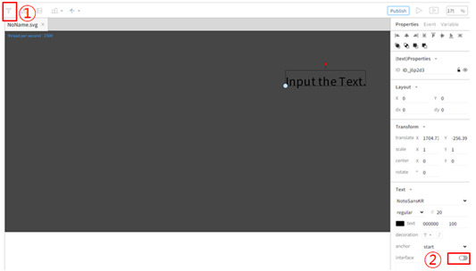
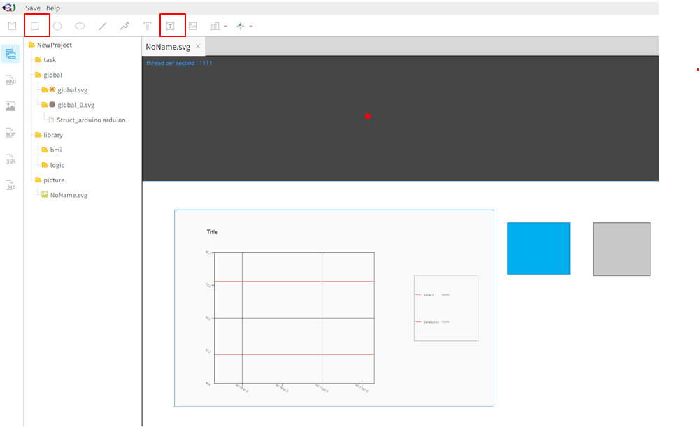

# enuSpace-Meta Web 사용 방법

## 데이터 연동
enuSpace-Meta 제작 편집기에서 생성한 테이블의 데이터를 연동한다.

<h4>1.우측 상단 Repository를 눌러 새 프로젝트를 생성 해 편집기 화면으로 이동합니다.</h4>

<h4>2.좌측 global - New Interface DB를 등록합니다. 이후 생성된 global_0.svg 클릭 후 Add Interface Itme을 클릭합니다.</h4>

<h4>3.테이블과 태그 생성이 잘 되었다면, 여기서 확인할 수 있습니다. 1번에서 테이블 선택 후, 2번에서 사용할 태그들을 선택 하고 Accept버튼을 누릅니다.</h4>

<h4>4.3번의 과정이 성공적으로 수행되었다면 좌측 Struct_arduino arduino라는 구조체를 확인할 수 있고, 확인하면 태그가 잘 담겨있는 모습을 볼 수 있습니다. </h4>
 

## 데이터 가시화
#### enuSpace-Meta 제작 편집기에서 연동한 데이터를 가시화할 수 있다.

본 예제에서는 차트와 텍스트를 통해 데이터를 가시화하는 예제를 설명합니다.

#### 차트

<h4>1.다음의 순서를 따라 차트를 생성합니다.</h4>

①,② 클릭 후 ③ 드래그

<h4>2.차트 클릭 후 우측 Properties - SeriseLine1을 클릭합니다.</h4>

<h4>3.우측 variable 내용에 #table.Tag 형식의 변수를 작성합니다.</h4>

예를 들어 가시화 할 Table이 arduino 이고 태그의 Variable_Name이 Tag_1이라면 #arduino.Tag_1 이라고 작성하면 됩니다.

<h4>4.추가를 원하면 그림의 Add Data를 클릭합니다.</h4>

추가하는 태그도 마찬가지로, #arduino.Tag_2 라고 작성합니다.
  
<h4>5.이후 프로젝트를 실행하면 연동된 데이터의 흐름을 확인할 수 있습니다.</h4>

#### 텍스트
<h4>1.프로젝트 좌측 상단 T 버튼을 눌러 텍스트 박스 객체를 생성합니다.</h4>

<h4>2.interface를 활성화 하고, variable 영역에 차트와 동일하게 #Table.Tag를 작성하면 됩니다.</h4>

<h4>3.이후 실행시 해당 텍스트는 태그의 Value가 출력됩니다.</h4>

## 데이터 쓰기
enuSpace-Meta 제작 편집기에서 연동한 데이터의 값을 DB에 쓸 수 있다.

한 사각형 객체를 클릭할 때마다 데이터가 10씩 감소되는 예시와 사용자가 입력한 값으로 데이터가 수정되는 예시를 설명한다.

#### 클릭시 10씩 감소
<h4>1.사각형 객체를 생성하고 onClick 이벤트 등록을 진행합니다.</h4>

<h4>2.onClick 이벤트 등록 스크립트는 다음 그림과 같이 작성합니다.</h4>

> value = arduino.Tag_1 ( Table.Tag => variable에 작성했던 부분에서 #만 제거)
> value라는 변수에 현재 arduino 테이블의 Tag_1 값을 담습니다.

> 데이터를 쓰는 SetTagValue함수는 String 형식의 데이터를 보내야하기 때문에 tostring을 통해 String 형식으로 변경합니다.

> SetTagValue Params ("테이블명","태그명","값") 

② 즉시 1회 실행
③ 확인
④ 컴파일 후 Output창에 문제가 없다면 regist success을 출력한다.

<h4>3.이후 프로젝트 실행 후 해당 객체를 클릭 할 때마다 value의 값이 10씩 줄어듭니다.</h4>

## 사용자가 입력한 값으로 데이터 쓰기
<h4>1.사용자가 값을 입력할 Input Text Box와 사각형 객체를 생성합니다.</h4>

<h4>2.Input Text Box의 ID를 value_box로 변경합니다.</h4>

<h4>3.사각형 객체에 onClick 이벤트를 등록합니다.</h4>

> * value = value_box.text ( Input Text Box의 ID.text ) 즉 사용자가 입력한 text입니다.
> * SetTagValue Params ("테이블명","태그명","값") 

<h4>4.이후 프로젝트 실행 후 Input Text Box의 사용자가 값을 입력하고, 파란색 사각형 객체를 클릭하면 값이 변경됩니다.</h4>

